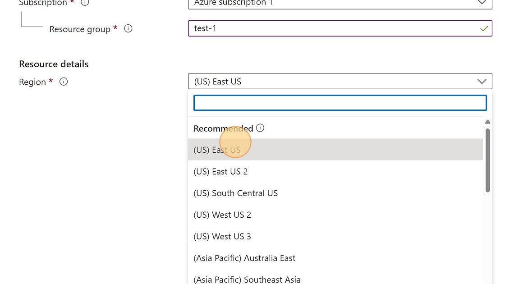

# Azure AI Translator Service 
 
 Account Creation Azure account 
  
  To get started, you need an active Azure account. If you don't have one, you can create a free 12-month subscription. 

# Create Resource Group 

  1. Navigate to https://portal.azure.com/

  2. Click "Resource groups"

    
  
  3. Click "+ Create" to create a new Resource Group.
   
     

 4. Select the Subscription from the drop down menu

    

 5. Name the new Resource group

    

 6. Select the Region. Even though you choose a region for your resource group, the resources that you put into it don't all have to be in that region!

      

 7. Click "Next : Tags >"

      

 9. Click "Next: Review + create >"

       

 10. Click Create.

       