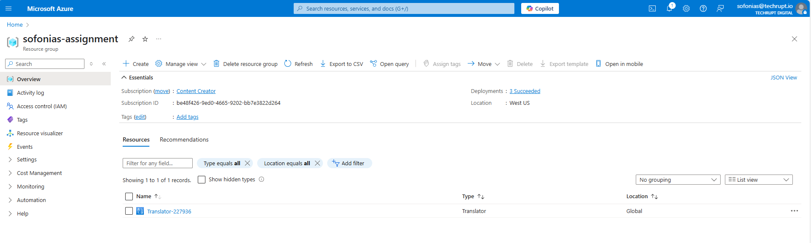
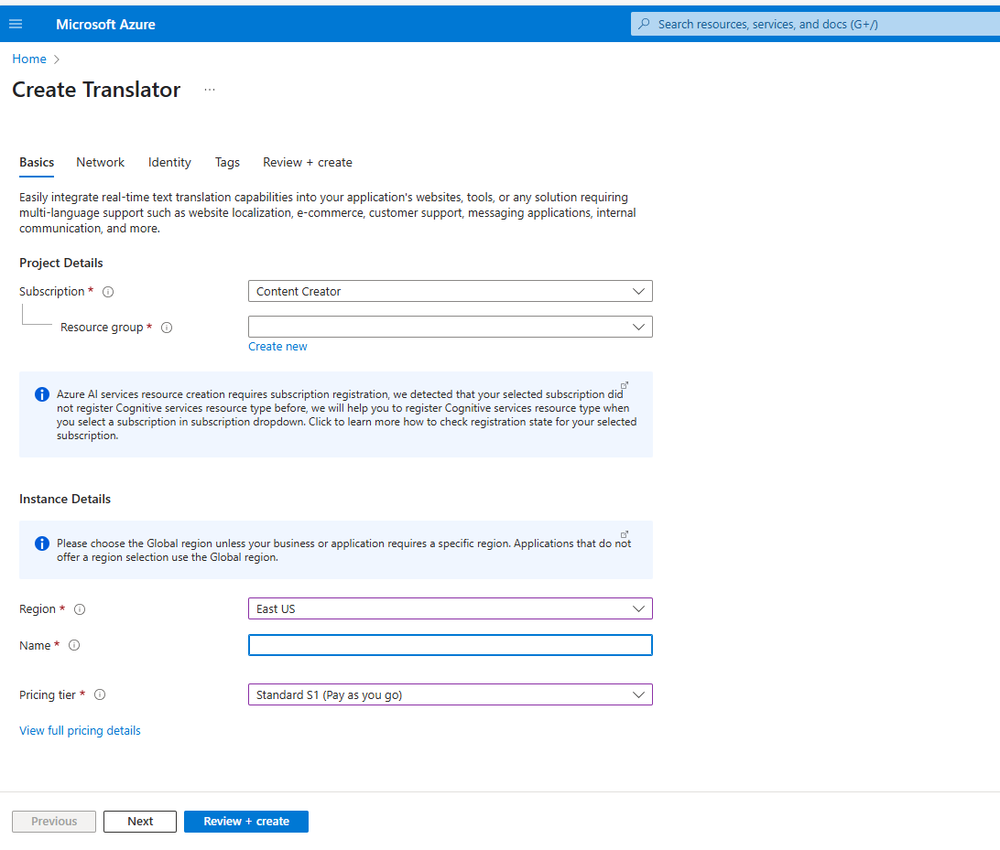
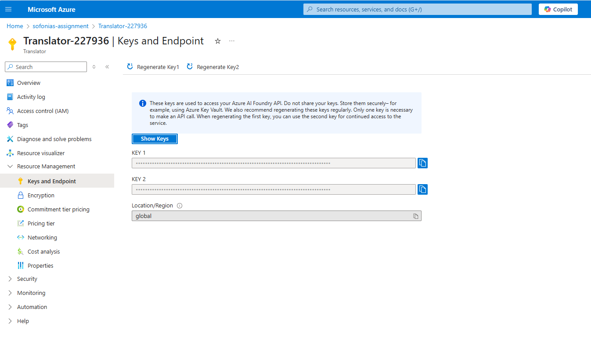

## Step 2: Create a Translator Resource
- In the search bar at the top, type **Translator** or **Cognitive Services**.
  
- Select **Translator** from the results.
  
- Click **+ Create** or **Create a resource** > Search **Translator** > Click **Create**.
  

---

## Step 2.1 : Choose Resource Type
- Select one of the following:  
  - **Single-service resource**  https://portal.azure.com/#create/Microsoft.CognitiveServicesTextTranslation  (for Translator API only)  
  - **Multi-service resource**  https://portal.azure.com/#create/Microsoft.CognitiveServicesAllInOne (for multiple AI services under one key)  
- Click **Next** or **Continue**.
 
   

---

## Step 2.2: Enter Project and Instance Details

| Field              | What to do                                                                                     |
|--------------------|------------------------------------------------------------------------------------------------|
| **Subscription**   | Select your Azure subscription to charge this resource.                                       |
| **Resource Group** | Select an existing resource group or create a new one.                                        |
| **Region**         | Choose the Azure region (Global is default; select specific region like East US for Document Translation). |
| **Name**           | Enter a unique name for your Translator resource (used in the endpoint URL).                  |
| **Pricing Tier**   | Choose a pricing tier:  
  - Free tier (one per subscription, unlimited time)  
  - Standard S1 (recommended for Document Translation) |

   

  

---

## Step 2.3: Review and Create
- Review the configuration details.
- Accept the terms of service.
- Click **Create** to deploy the Translator resource.

  

---

## Step 2.4: Access Your Translator Resource
- After deployment completes, click **Go to resource**.
  
  
---

## Step 2.5: Get Authentication Keys and Endpoint URL
- In the resource page, navigate to **Keys and Endpoint**.
- Copy either **Key1** or **Key2** — your API key.
- Copy the **Endpoint URL**, typically:  
  `https://api.cognitive.microsofttranslator.com`

   

---

## Step 2.6: Use the Translator API
- Use the **endpoint URL** and **API key** to authenticate API requests.
- Pass the API key in HTTP request headers as:  

  