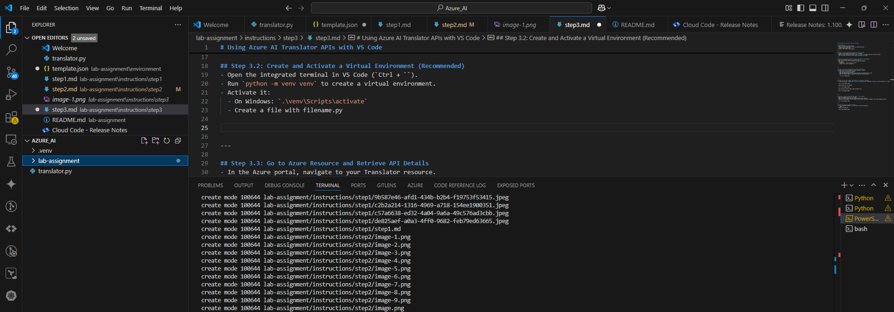
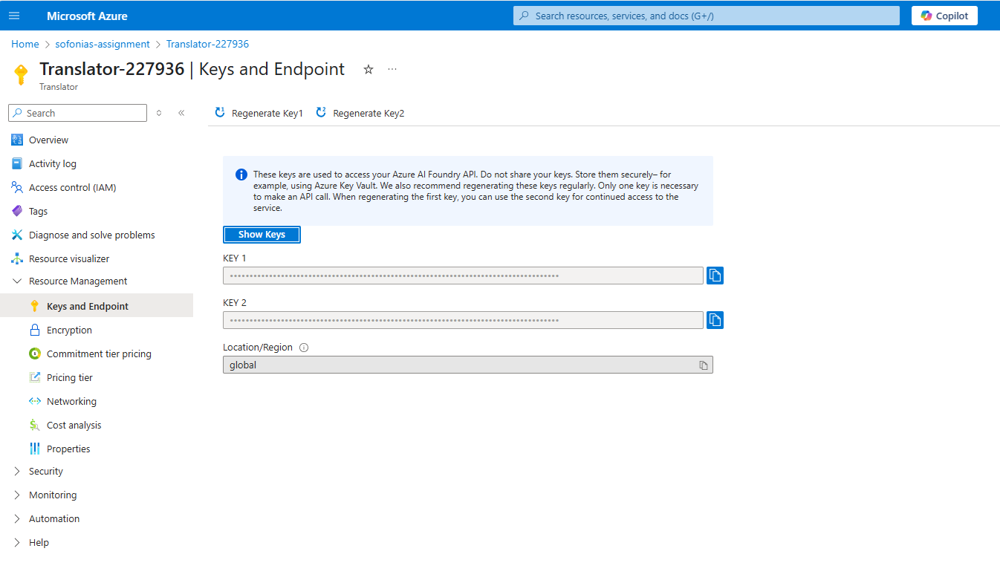
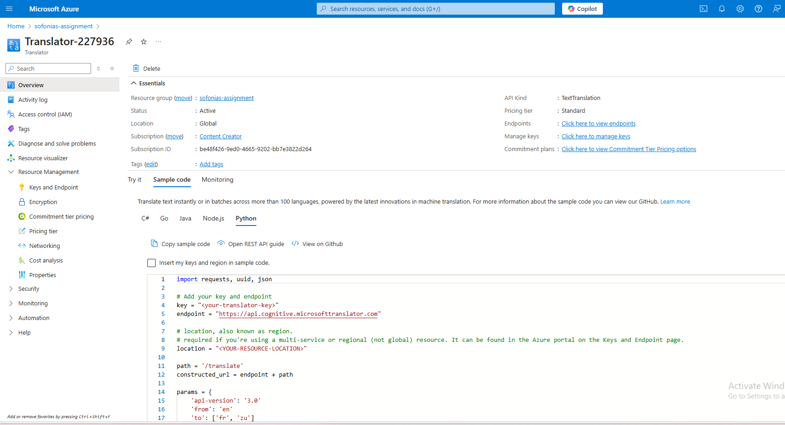
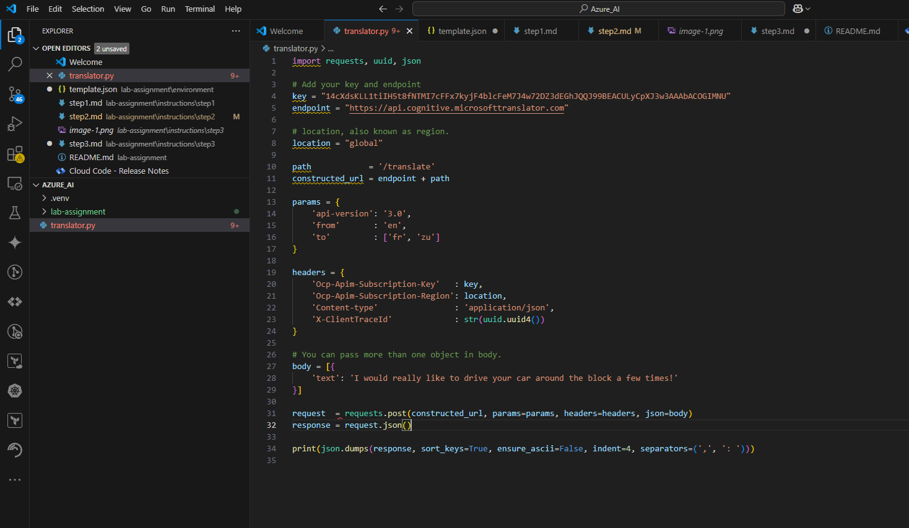
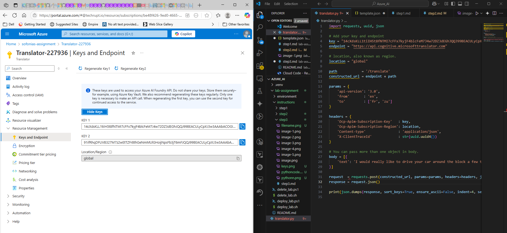
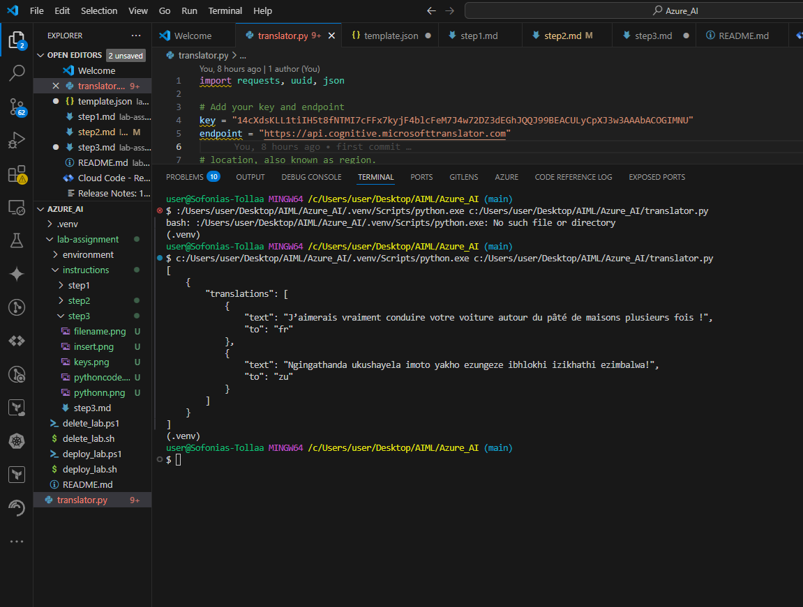

# Using Azure AI Translator APIs with VS Code

## Prerequisites
- Have an active Azure subscription.
- Create an Azure Translator resource in the Azure portal.
- Install Visual Studio Code.
- Install .NET 6 SDK on your machine.

---

## Step 3.1: Set Up Your Project Folder and Open VS Code
- Create a folder anywhere you prefer (e.g., Desktop).
- Right-click the folder and choose **Open with Code** (or open VS Code and open the folder).
- This will open the folder as your project workspace in VS Code.

---

## Step 3.2: Create and Activate a Virtual Environment (Recommended)
- Open the integrated terminal in VS Code (`Ctrl + ``).
- Run `python -m venv venv` to create a virtual environment.
- Activate it:
  - On Windows: `.\venv\Scripts\activate`
  - Create a file with filename.py 

    

---

## Step 3.3: Go to Azure Resource and Retrieve API Details
- In the Azure portal, navigate to your Translator resource.
- In the **Keys and Endpoint** section:
  - Copy the Key (Subscription Key).
  - Copy the Endpoint URL. "https://api.cognitive.microsofttranslator.com"
  - Copy the Location/Region (required for some API configurations).

    


---

## Step 3.4: Pull the command using Python or any selected language
- In the Azure portal, within the **Overview** section of your Translator resource, find the Quickstart or Sample code area.
  
  

- Choose Python as the language.
 

- Copy the entire Python sample code provided there.

  


---

## Step 3.5: Insert the Key and the region on the command
- Open the translator.py file in VS Code.
- Paste the Python sample code you copied from the Azure portal.
- Replace the placeholders in the sample code with your actual Key, Endpoint, and Location/Region values.

   


## Step 3.6: Run the command and check
- In the integrated terminal, run the Python script by executing:
  ```bash
  python translator.py


  

---


 
